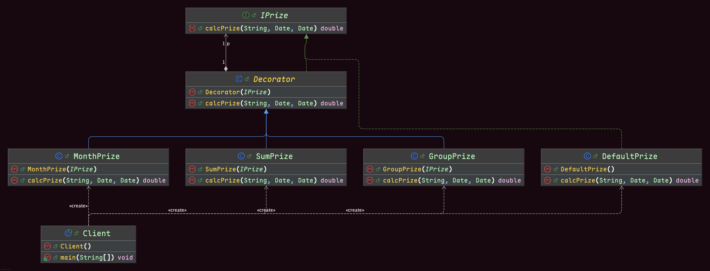

## 复杂的奖金计算

奖金计算是相对复杂的功能，尤其是对业务部门的奖金计算方式，是非常复杂的，除了业务功能复杂外，还有一个麻烦之处就是计算方式还经常需要变动，因为业务部门
要通过调整奖金的计算方式来激励士气。
下面就是现有的奖金计算方式：
* 首先是奖金分类，对于个人大致有个人当月业务奖金，个人累计奖金，个人业务增长奖金，及时回款奖金，限时成交加码奖金等；对于业务主管或者业务经理，除了个人奖金外，还有团队累计奖金，团队业务增长奖金，团队盈利奖金等。
* 其次是计算奖金的金额，又有这么几个基数，销售额，销售毛利，实际回款，业务成本，奖金基数等。
* 另外一个就是计算公式，针对不同的人，不同的奖金类别，不同的计算奖金金额，计算的公式不同的，即使是同一个公式，里面计算的比例参数也有可能是不同的。

## 简化后的奖金计算体系
* 每个人当月业务奖金 = 当月销售额 * 3%
* 每个人累计奖金 = 总的回款额 * 0.1%
* 团队奖金 = 团队总销售额 * 1%

## 最终程序结构示意图
